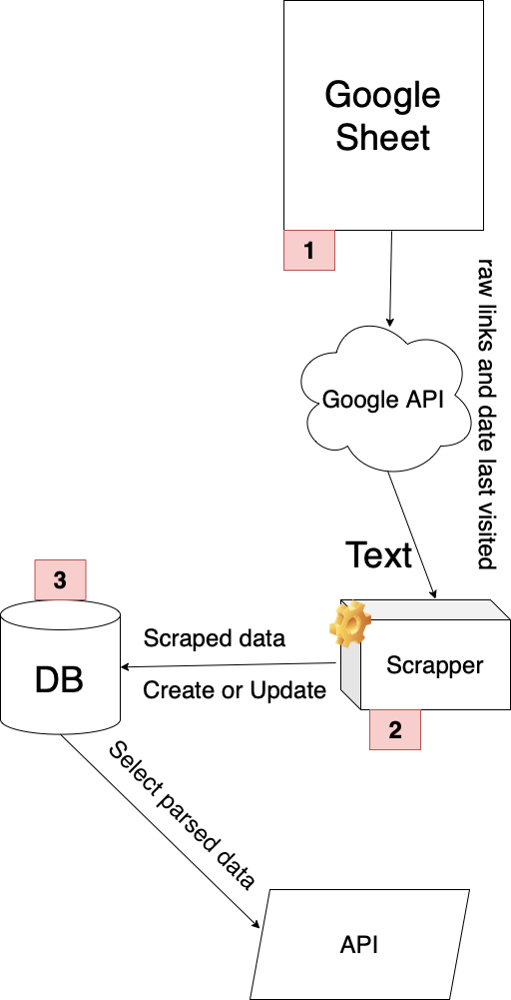

# Scraper for visited links and API

## Project structure



### Project contains 2 parts: *Scraper* and *Async API with Async Postgres on SQLAlchemy*


### Scraper

- Take raw data from Google Sheets use Google API (Date, URL)
- Scrap data from URLs, parse Date and write parsed data to RDB (postgres)

*Main files*
- scrapers/scraper.py - module for do URLs scraping
- scrapers/run_scraping.py - scraper runner. It creates DB tables if not exist, get data from Google Sheet, scrap it and write scraped data to Postgres
- managers/gsheet_manager.py - manager for working with Google API

### API and DB
- Async API use FastAPI
- Async SQLAlchemy with Postgres

*Main files*
- api.py - FastAPI application 
- sql_app/database.py - SQLAlchemy engine and session
- sql_app/crud.py - CRUD methods for SQLAlchemy
- sql_app/model.py - DB Model
- sql_app/schemas.py - Pydantic Models for validation


# How to run

### Clone the project
```
git clone https://github.com/serebrich/visited_links_scraper_with_api.git
```

### Create Virtual Environment (python 3.6 or above)
```
python3 -m venv venv
```
or
```
python -m venv venv
```
### Activate Virtual Environment
```
source venv/bin/activate
```

### Install requirements
```
pip install -r path/to/project/requirements.txt
```

### Copy GoogleAPIKey and .env file in project
> /managers/google_api_key.json
> 
> /.env

### Scrap data 
```
cd scrapers
python3 run_scraping.py
```
Note: scraped data already exists in DB, if you run scraper it will be update

### Run FastAPI application
from root project directory
```
uvicorn api:app
```
it runs on port **8000**

### Api doc
If it runs on localhost, Doc will be [HERE](http://127.0.0.1:8000/docs)

